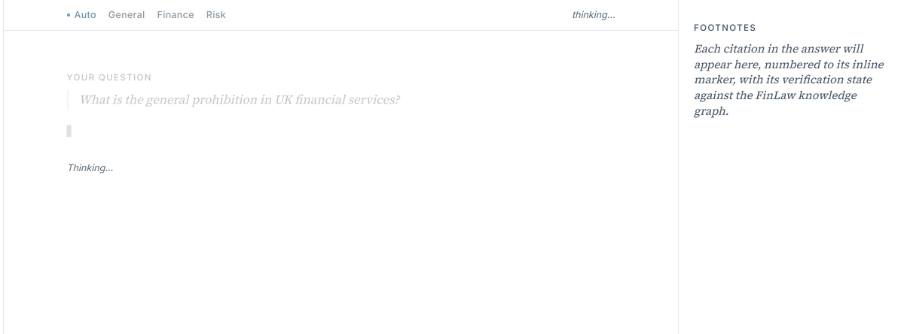
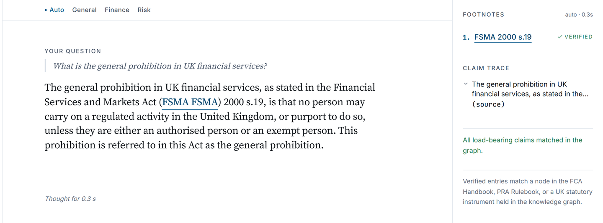
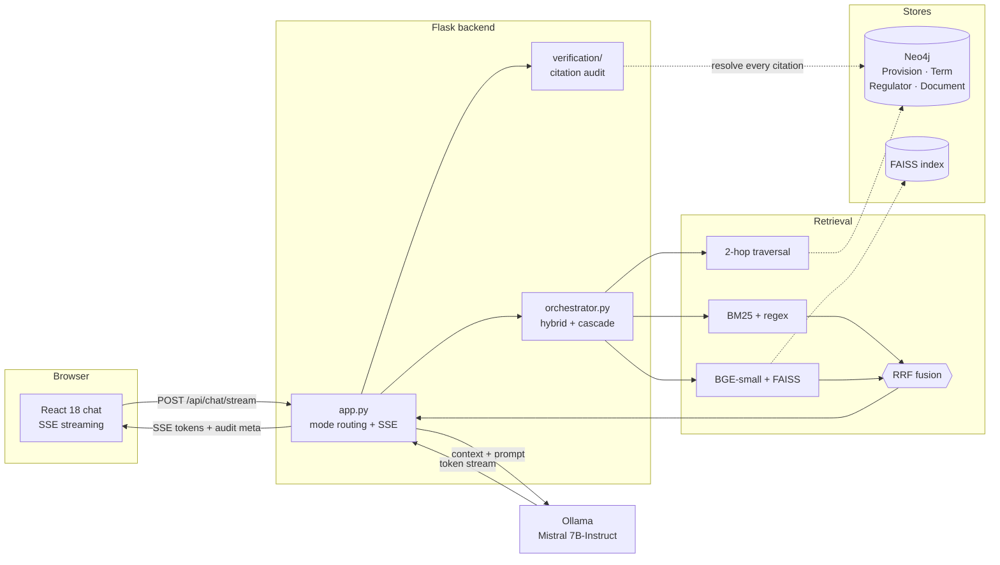
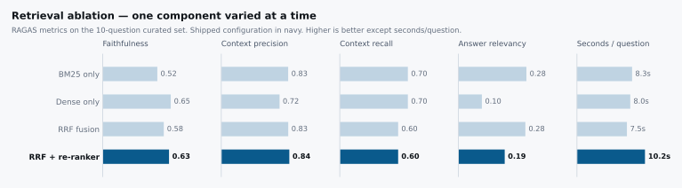
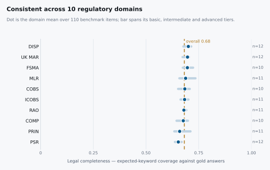
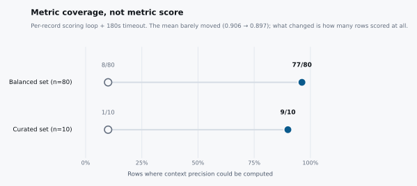
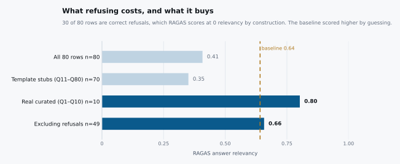

<div align="center">

# FinLaw-UK

**A retrieval system for UK financial regulation that can prove its citations exist,
and refuses to answer when it can't.**

[](https://github.com/1oNN/finlaw-uk/actions/workflows/ci.yml)
[](https://www.python.org/)
[](https://react.dev/)
[](https://neo4j.com/)
[](https://ollama.com/)
[](LICENSE)

</div>

Graph-augmented RAG over legislation.gov.uk, the FCA Handbook and the PRA
Rulebook. Hybrid BM25 + dense retrieval fused by reciprocal rank fusion, 2-hop
traversal of a Neo4j provision graph, and a verifier that checks every citation
against that graph before the answer reaches the user.

*MSc dissertation project. MSc Applied Artificial Intelligence and Data
Analytics, University of Bradford, 2025. Supervised by Dr Tillal Eldabi and
Dr Irfan Mehmood.*

<div align="center">
  
</div>

Asking *"What is the general prohibition in UK financial services?"* returns an
answer cited to `FSMA 2000 s.19`, and the footnotes panel reports that citation
as **verified**, meaning a matching provision node was found in the graph, and
every load-bearing claim traced back to it.



---

## Why this is different

Most regulatory chatbots are a vector store and a prompt. Three things here are not.

**1 · Citations are verified, not just generated.**
When the model writes `FSMA 2000 s.21`, that string is resolved against the
knowledge graph. If no matching `Provision` node exists, the answer is flagged
to the user rather than passed through. A fabricated citation in regulated
finance is a compliance incident, not a typo.

**2 · It refuses rather than guesses.**
A dense-similarity gate declines to answer when retrieval is genuinely weak.
This costs measurable points on standard benchmarks, and [the results section
below shows exactly how many](#what-refusing-costs). That trade is the product.

**3 · Nothing leaves the machine.**
Mistral 7B-Instruct via Ollama, FAISS on disk, Neo4j in Docker. No query about a
client's regulatory exposure is sent to a third-party API, which is the actual
deployment constraint in this domain.

---

## How it works



A question is answered in three passes: **retrieve** (sparse and dense in
parallel, fused by RRF, widened by graph traversal), **generate** (streamed from
a local Mistral), then **verify** (every citation resolved against Neo4j, with a
claim trace attached to the response).

<details>
<summary><b>Request lifecycle in detail</b></summary>

```
1.  POST {prompt, filename?, mode?}                      frontend → app.py
2.  get_graph_boost(query)                               → Neo4j fulltext, top-6 seeds
3.    neighbors_2hop(seeds) via :CITES|:DEFINED_BY       → context bullets + source line
4.  get_context(query)                                   → orchestrator
       primary:  BM25 ∪ dense → reciprocal rank fusion
       cascade:  phrase regex → keyword overlap → uploads → remote
5.  Mode routing → FINANCE_QA_PROMPT / TRAFFIC_LIGHT_PROMPT / GENERAL_PROMPT
6.  Stream tokens from Ollama, suppressing <think> blocks
7.  Post-process: normalise citations → fix currency → bootstrap short answers
8.  Citation audit: find_invalid_citations() → patch with warning
9.  Graph verification: verify_answer() → {all_grounded, verified, unverified}
10. Claim trace: trace_all() → [{claim, best_match}]
11. Emit consolidated event:meta, then event:done
```

Full detail in [docs/ARCHITECTURE.md](docs/ARCHITECTURE.md).

</details>

<details>
<summary><b>Retrieval: why hybrid, and what fusion buys</b></summary>

Statutory text is unusually hostile to pure dense retrieval: provisions are
short, heavily numbered, and share near-identical boilerplate, so embeddings
cluster tightly and rank poorly on exact references like `COBS 4.12R`. BM25
handles the reference lookup; the bi-encoder handles paraphrased questions.
Reciprocal rank fusion merges the two ranked lists without needing calibrated
scores across them.

- `backend/retrieval/sparse.py`: BM25, phrase regex, keyword overlap
- `backend/retrieval/dense.py`: `BAAI/bge-small-en-v1.5` + FAISS `IndexFlatIP`
- `backend/retrieval/hybrid.py`: `reciprocal_rank_fusion(rank_lists, k, rrf_k)`
- `backend/retrieval/orchestrator.py`: hybrid-first with a fallback cascade

The measured effect of each component is in [the ablation below](#retrieval-ablation).

</details>

<details>
<summary><b>The knowledge graph</b></summary>

Provisions are ingested from legislation.gov.uk XML and supplementary FCA/PRA
PDFs, then linked by regex-extracted cross-references.

| Node | Meaning |
|---|---|
| `Provision` | A section, article or handbook rule |
| `Term` | A defined term, linked by `:DEFINED_BY` |
| `Regulator` | FCA, PRA, Bank of England |
| `Document` | Source instrument or handbook module |

Edges are `:CITES` (provision → provision, regex-extracted) and `:DEFINED_BY`.
2-hop traversal from the top fulltext seeds pulls in provisions that the
question doesn't name but that the cited rules depend on.

Schema and example Cypher: [docs/NEO4J_SCHEMA.md](docs/NEO4J_SCHEMA.md).

</details>

---

## Results

Two evaluations exist for this project and **they do not measure the same
system.** Both are reported below, in order, because the difference between them
is the most interesting result the project produced.

| | Track 1: dissertation | Track 2: re-measurement |
|---|---|---|
| Date | September 2025 (submitted, examined) | Post-submission |
| Retrieval | Dense + graph boost | + BM25, RRF fusion, cross-encoder re-ranker |
| Citations | Generated, format-checked | Resolved against the graph; refusal gate |
| Scale | 110 items | 110-item lexical run; RAGAS on 80; ablation n=10/arm |
| Reported in | [Dissertation](docs/DISSERTATION.pdf) §4 | This README |

Neither the re-ranker nor the citation verifier nor the refusal gate existed
when Track 1 was run. Figures from the two tracks are not comparable and should
not be quoted side by side as if they were.

### Track 1: dissertation evaluation (September 2025)

The submitted evaluation used a design science research methodology, pairing
RAGAS with five custom lexical metrics over a 110-item benchmark (80 factual
questions, 20 document tasks, 10 case scenarios; 23% basic, 50% intermediate,
27% advanced), alongside qualitative stakeholder assessment.

The dissertation reports these figures in three places, and they do not agree:

| Metric | Abstract | §4.3 Overall | §4.8 Summary |
|---|---|---|---|
| Source accuracy | n/a | 0.823 | 0.756 |
| Citation quality / precision | 0.56 | 0.806 | 0.557 |
| Legal completeness | 0.69 | 0.682 | 0.689 |
| Semantic similarity | n/a | 0.672 | 0.688 |
| Keyword recognition | n/a | 0.681 | n/a |
| Legal terminology use | n/a | 0.693 | n/a |
| RAGAS faithfulness | 0.76 | n/a | n/a |
| RAGAS answer relevance | 0.74 | n/a | n/a |

§4.3 additionally states that "completeness and citation quality remained below
0.70 across all complexity levels", two paragraphs after reporting citation
quality at 0.806. Document tasks were the strongest task type (source accuracy
and citation quality above 0.83); scenario tasks the weakest (completeness
frequently below 0.65).

**What holds and what doesn't.** Legal completeness, semantic similarity and
keyword recognition are lexical overlap measures and reproduce on re-run;
completeness in particular is stable at 0.68 across both tracks. Source accuracy
and citation quality do not hold, for the reason given in
[Measurement integrity](#measurement-integrity) below. The 0.56 citation figure
in the abstract is closer to the truth than the 0.806 in §4.3.

### Track 2: re-measurement

Every figure below is regenerated from committed data by
[`scripts/make_readme_charts.py`](scripts/make_readme_charts.py).

#### Retrieval ablation

One retrieval component varied at a time, question set held fixed.

<picture>
  <source media="(prefers-color-scheme: dark)" srcset="docs/assets/ablation_dark.svg">
  
</picture>

**No arm dominates, and the honest reading matters more than a winner.** The
re-ranker buys context precision (0.83 → 0.84) and faithfulness (0.58 → 0.63)
for a 36% latency cost. Dense-only retrieval wins recall but collapses on answer
relevancy, exactly the failure mode described above, where embeddings cannot
separate near-identical statutory boilerplate. BM25 alone is a surprisingly
strong baseline on precision, which is why the fused configuration ships rather
than the dense one.

<details>
<summary>Underlying numbers</summary>

| arm | faithfulness | context precision | context recall | answer relevancy | s/question |
|---|---|---|---|---|---|
| BM25 only | 0.5217 | 0.8258 | 0.70 | 0.2818 | 8.28 |
| Dense only | 0.6500 | 0.7195 | 0.70 | 0.0973 | 8.00 |
| RRF fusion | 0.5833 | 0.8267 | 0.60 | 0.2774 | 7.50 |
| **RRF + re-ranker** | **0.6333** | **0.8400** | 0.60 | 0.1919 | 10.21 |

Source: [`data/eval_results/ablation.csv`](data/eval_results/ablation.csv), n=10 per arm.

</details>

#### Coverage across the regulatory corpus

<picture>
  <source media="(prefers-color-scheme: dark)" srcset="docs/assets/coverage_dark.svg">
  
</picture>

110 items spanning 80 factual questions, 20 document tasks and 10 case
scenarios, across ten regulatory domains and three complexity tiers. Legal
completeness, the share of expected keywords present in the answer, sits in a
tight band around 0.68 with no domain materially weaker than any other, and no
degradation from basic to advanced questions. Median latency 5.8 s per query.

This is the one headline figure that is consistent across both evaluation
tracks and both scoring implementations.

#### Measurement integrity

This section is deliberately above the fold rather than in a linked appendix.

<picture>
  <source media="(prefers-color-scheme: dark)" srcset="docs/assets/measurability_dark.svg">
  
</picture>

The headline change to context precision is **coverage, not score**. The mean
barely moved (0.906 → 0.897); what changed is that the metric now returns a
value for 77 of 80 rows instead of 8, after switching to a per-record scoring
loop with a 180 s timeout. Reporting that as a quality improvement would be
wrong.

Three limitations are load-bearing enough to state plainly:

- **`faithfulness` and `context_recall` are currently un-measurable, not
  degraded.** RAGAS invokes four judge jobs concurrently against a single Ollama
  instance and the output comes back malformed; the same prompts parse correctly
  when probed serially. Candidate fix (`RAGAS_MAX_WORKERS=1`) is documented and
  untested. See [docs/EVALUATION_DIAGNOSTICS.md](docs/EVALUATION_DIAGNOSTICS.md) §9.
- **70 of the 80 rows in `questions_80_balanced.csv` are template stubs** with
  semantically empty gold answers. The curated 10 is the meaningful set.
- **`source_accuracy` and `citation_quality` are not reported as results**,
  despite existing in the results files and in the dissertation.
  `score_citations()` in `scripts/run_eval_and_charts.py` awards a flat `0.85`
  for any citation-shaped string, verified or not, and 103 of 110 rows carry
  exactly that constant. They measure citation *shape*, not correctness. The
  0.823 and 0.806 in dissertation §4.3 rest on this function and should be read
  as format-conformance rates, not accuracy.

The honest citation figure from the 110-item run is that only **3 of 110
answers passed graph verification**. That finding is what motivated the citation
normaliser, the re-ranker and the refusal gate that followed it. There is no
re-run at that scale yet. See [Known limitations](#known-limitations).

#### What refusing costs

<picture>
  <source media="(prefers-color-scheme: dark)" srcset="docs/assets/refusal_dark.svg">
  
</picture>

Headline answer relevancy falls 23 points against the baseline, and that is the
refusal gate working correctly. Thirty of eighty rows are refusals; RAGAS scores
a refusal at 0 relevancy by construction, because the refusal text does not echo
the question's wording. Excluding refusals the mean is **0.6575 against the
baseline's 0.6412**. The baseline scored higher on the headline by
confabulating answers to nonsense questions instead of declining them.

### Which figures to cite

For anyone quoting this project, including its author:

| Safe to cite | Cite with the caveat | Do not cite |
|---|---|---|
| Legal completeness 0.68 | Dissertation RAGAS faithfulness 0.76, answer relevance 0.74 (Track 1 system, not re-measured) | Source accuracy 0.82 |
| 3/110 graph-verified citations (pre-verifier baseline) | Ablation figures (n=10 per arm) | Citation quality 0.81 |
| Median latency 5.8 s | Refusal-excluded relevancy 0.6575 vs 0.6412 baseline | Anything from `score_citations()` |

---

## Tech stack

| Layer | Tech | Where it lives |
|---|---|---|
| Hybrid retrieval | BM25 + BGE-small + FAISS + RRF | `backend/retrieval/` |
| Knowledge graph | Neo4j 5: `Provision`, `Term`, `Regulator`, `Document` | `backend/graph/` |
| Ingestion | legislation.gov.uk XML + PDF corpus + LangChain chunking | `backend/graph/ingest_xml.py`, `extract_pdfs.py` |
| Generator | Mistral 7B-Instruct via Ollama | `backend/llm/` |
| Verification | Graph-grounded citation lookup + claim trace | `backend/verification/` |
| Evaluation | RAGAS + lexical benchmark | `backend/evaluation/` |
| Frontend | React 18 + Tailwind 3, SSE streaming | `frontend/` |

---

## Quickstart

Requires Python 3.11, Node 18+, Docker, and [Ollama](https://ollama.com/).

```bash
git clone https://github.com/1oNN/finlaw-uk.git
cd finlaw-uk

# 1. Neo4j
docker compose up -d

# 2. Model  (first pull is ~4 GB; pre-warm before timing anything)
ollama pull mistral:7b-instruct
ollama run mistral:7b-instruct "warm up" >/dev/null

# 3. Backend
python -m venv .venv && source .venv/bin/activate   # Windows: .venv\Scripts\activate
pip install -r requirements.txt
cp .env.example .env
python -m scripts.seed_neo4j          # one-off graph ingestion
python -m backend.app

# 4. Frontend
cd frontend && npm install && npm start
```

> **Cold start.** The first request after a restart builds the FAISS cache and
> loads Mistral into memory. First byte can take several minutes on a cold
> model. Pre-warm Ollama as above before benchmarking or demoing.

Full walkthrough for Windows / macOS / Linux: [docs/RUN.md](docs/RUN.md).
Hardware and software requirements: [docs/REQUIREMENTS.md](docs/REQUIREMENTS.md).

---

## Testing

```bash
pytest -q tests/
```

57 tests covering retrieval fusion and the fallback cascade, graph traversal,
citation normalisation, graph verification, claim tracing, upload parsing and
the evaluation scorers. The suite is hermetic: external calls are stubbed and
the graph and remote paths are disabled in `tests/conftest.py`, so CI runs it
whole with no Neo4j and no Ollama.

---

## Known limitations

- `ragas_faithfulness` and `ragas_context_recall` are un-measurable under
  RAGAS's parallel judge invocation against a single Ollama instance
  ([diagnostics §9](docs/EVALUATION_DIAGNOSTICS.md)).
- 70 of the 80 rows in `questions_80_balanced.csv` are template stubs;
  `questions_10_curated.csv` is the meaningful evaluation set.
- The Neo4j graph is missing the `:MENTIONS` relationship type, so 2-hop
  traversal returns fewer related citations than the schema implies.
- The 110-item benchmark predates the citation verifier, re-ranker and refusal
  gate. Its 3/110 graph-verified citation rate is a *before* measurement; the
  pipeline has not been re-run at that scale since.
- `source_accuracy` and `citation_quality` in the committed result files, and
  the corresponding figures in dissertation §4.3, are regex shape-checks, not
  correctness measures. Do not read them as results.
- The dissertation reports source accuracy and citation quality inconsistently
  across its abstract, §4.3 and §4.8. Track 2 supersedes all three.

---

## Documentation

**Design** · [Architecture](docs/ARCHITECTURE.md) · [Workflow](docs/WORKFLOW.md) · [Neo4j schema](docs/NEO4J_SCHEMA.md) · [DSR mapping](docs/DSR_MAPPING.md)

**Evaluation** · [RAGAS methodology](docs/RAGAS_RESULTS.md) · [Diagnostics](docs/EVALUATION_DIAGNOSTICS.md) · [Baseline comparison](docs/EVALUATION_COMPARISON.md) · [Qualitative summary](docs/QUALITATIVE_SUMMARY.md)

**Setup** · [Requirements](docs/REQUIREMENTS.md) · [Run guide](docs/RUN.md)

---

## Acknowledgements

University of Bradford, MSc Applied Artificial Intelligence and Data Analytics.
Supervised by Dr Tillal Eldabi and Dr Irfan Mehmood.

## License

Distributed under the MIT License. See [LICENSE](LICENSE) for details.
