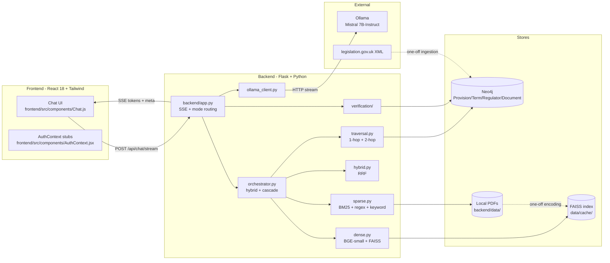

# Architecture

How a question flows through FinLaw-UK from the user's browser to the
streaming SSE response, and where each design decision lives in the
code.

## High-level diagram



Solid arrows are per-request; dashed arrows are one-off ingestion paths
that populate Neo4j and the FAISS cache.

## Request lifecycle (`POST /api/chat/stream`)

```
1.  POST {prompt, filename?, mode?, model?}                                 (frontend → app.py)
2.  if filename present: uploaded text loaded from UPLOADED_TEXTS           (app.py)
3.  query_hint = prompt[:120]
4.  gboost = get_graph_boost(query_hint)                                    (orchestrator → traversal → Neo4j)
       step 4a: fulltext query on provisionIdx (top-6 seeds)
       step 4b: neighbors_2hop(seeds) via :CITES|MENTIONS|DEFINED_BY
       returns context_md + source_line + must_terms
5.  retrieved = get_context(query_hint)                                     (orchestrator)
       primary:   _hybrid_search → BM25 ∪ dense → RRF
       fallback:  phrase regex → keyword overlap → uploads → remote
6.  Mode routing:                                                           (app.py)
       use_finance  = mode in {finance, traffic-light} ∨ is_finance_intent
       use_traffic  = mode == traffic-light ∨ is_traffic_light_intent
       system_msg   = TRAFFIC_LIGHT_PROMPT / FINANCE_QA_PROMPT / GENERAL_PROMPT
7.  Build messages = [{system, user}] including hint_line and ctx
8.  Stream tokens from Ollama:                                              (ollama_client.generate_stream)
       suppress <think>...</think> blocks; emit `event:meta thought_ms` when closed
       relay everything else as `data:<token>` SSE frames
9.  Post-process buffered full_text:
       scrub_known_bad → normalise_citations → fix_currency → bootstrap_answer (if short)
10. If traffic-light mode: coerce_to_traffic_light(full_text)
11. If not traffic-light and no Source line: append Source: gboost.source_line
12. Citation audit:
       find_invalid_citations(full_text) → patch_with_warning(...)          (app.py)
13. STAGE 4 — graph-grounded verification:                                  (verification/graph_verify)
       verify_answer(full_text, context_cites) → {all_grounded, verified, unverified, hallucinated_context}
       if not all_grounded: append a ⚠️ footer warning the user
14. STAGE 4 — claim trace:                                                  (verification/claim_trace)
       trace_all(full_text, verified_cites) → [{claim, best_match}]
15. Emit consolidated `event:meta` with audit + verification + claim_trace
16. Emit `event:done`
```

## Component responsibilities

| Module | Responsibility |
|---|---|
| `backend/app.py` | Flask app, SSE streaming, mode routing, citation audit, verification orchestration |
| `backend/llm/ollama_client.py` | HTTP streaming client for Ollama. Owns model+option negotiation |
| `backend/llm/hf_client.py` | Opt-in `HFMistralClient` (LangChain `LLM` subclass) for the RAGAS judge |
| `backend/retrieval/sparse.py` | In-memory document store, PDF/DOCX/TXT loaders, phrase / keyword / BM25 / remote search |
| `backend/retrieval/dense.py` | `DenseRetriever` — BGE-small + FAISS, NumPy fallback, `.npy`+JSON cache |
| `backend/retrieval/hybrid.py` | `reciprocal_rank_fusion(rank_lists, k, rrf_k)` |
| `backend/retrieval/orchestrator.py` | `get_context`, `get_raw_context`, `gather_contexts`, `get_graph_boost`, hybrid pipeline + cascade fallback |
| `backend/graph/client.py` | Lazy-singleton Neo4j driver, `get_session()` context manager |
| `backend/graph/schema.py` | Node labels, relationship types, indexes, `KNOWN_REGULATORS`, `KNOWN_DOCUMENTS` |
| `backend/graph/seed.py` | Schema setup, provision MERGE, term/regulator/document linking, `:CITES` MERGE in 1000-row batches |
| `backend/graph/ingest_xml.py` | legislation.gov.uk fetcher + parser, `_iter_provisions`, `_maybe_chunk` (LangChain → fallback) |
| `backend/graph/extract_pdfs.py` | Supplementary FCA/PRA PDF ingestion via pdfplumber |
| `backend/graph/extract_xrefs.py` | Regex cross-reference extraction (statutory + handbook + context-aware) |
| `backend/graph/traversal.py` | `search_provisions`, `neighbors`, `neighbors_2hop`, `build_graph_context` |
| `backend/verification/citations.py` | Near-miss citation normaliser (15 regex remappings) |
| `backend/verification/graph_verify.py` | `verify_citation_against_graph`, batch lookup, `verify_answer` |
| `backend/verification/claim_trace.py` | `extract_claims`, `trace_claim_to_provision`, `trace_all` |
| `backend/ingestion/documents.py` | Upload pipeline parsers (PDF/DOCX/TXT/Excel/PPTX) feeding the sparse index |
| `backend/evaluation/lexical.py` | Legacy lexical evaluator (Jaccard + ROUGE-L + BERTScore via HTTP) |
| `backend/evaluation/ragas_eval.py` | RAG pipeline + RAGAS scoring with local Mistral judge |
| `backend/evaluation/runner.py` | Combined lexical + RAGAS orchestration + CSV output |

## Data flow — ingestion vs query time

### Ingestion (once per corpus update)

```
legislation.gov.uk XML    →  ingest_xml.parse_legislation_xml  →  Provision dicts
backend/data/*.pdf        →  extract_pdfs.ingest_pdfs           →  Provision dicts
                                       ↓
                         seed.seed_provisions(provisions)
                                       ↓
                              Neo4j (MERGE)
                                       ↓
                  extract_xrefs.extract_all_by_id(provisions)
                                       ↓
                       Neo4j :CITES edges (batched UNWIND)
```

The dense retriever cache is built **lazily** on the first chat after a
backend restart, not during seed. It indexes `backend/data/` PDFs (not
the Neo4j provisions) — that's because Neo4j fulltext serves the graph
side, and dense covers everything in the file corpus.

### Query time (every chat request)

```
question  ──▶  get_graph_boost ──▶ Neo4j fulltext  ──▶ neighbors_2hop ──▶ source_line + bullets
       │
       ├──▶  get_raw_context ──▶ _hybrid_search ──▶ BM25 + Dense ──▶ RRF ──▶ snippets
       │                            │
       │                            ├── falls back to phrase / keyword / uploads / remote
       │
       ├──▶  Ollama (Mistral) ──▶ streaming tokens
       │
       └──▶  verify_answer + trace_all ──▶ SSE meta event
```

## Where each of the 17 design picks lives

| # | Pick | Implementation |
|---|---|---|
| 2 | **B** Hybrid sparse + dense via RRF | `backend/retrieval/orchestrator.py::_hybrid_search` |
| 3 | **A** `BAAI/bge-small-en-v1.5` | `backend/retrieval/dense.py::DEFAULT_MODEL` |
| 4 | **A** FAISS `IndexFlatIP` | `backend/retrieval/dense.py::DenseRetriever._build_faiss_index` |
| 6 | **B** legislation.gov.uk XML | `backend/graph/ingest_xml.py::LEGISLATION_SOURCES` |
| 7 | **C** XML section parsing | `backend/graph/ingest_xml.py::_iter_provisions`, `_heading_for`, `_number_for` |
| 8 | **A** Regex cross-references | `backend/graph/extract_xrefs.py` |
| 9 | **D** Populate unused edges + **A** new node types | `backend/graph/seed.py::_enrich_graph`, `backend/graph/schema.py::KNOWN_REGULATORS/KNOWN_DOCUMENTS` |
| 10 | **A** 2-hop Cypher | `backend/graph/traversal.py::neighbors_2hop` |
| 11 | **A** Graph-grounded citation lookup | `backend/verification/graph_verify.py` |
| 12 | **C** Citation-grounded claim trace | `backend/verification/claim_trace.py` |
| 15 | **B** Real `ragas` + local Mistral judge | `backend/evaluation/ragas_eval.py::_ragas_evaluate` |
| 16 | **B + C** Re-run + honest interview line | `docs/RAGAS_RESULTS.md`, `docs/INTERVIEW_QA.md` |
| 17 | **A** DSR prep doc | `docs/DSR_MAPPING.md` |
| 18 | **B** LangChain chunking only | `backend/graph/ingest_xml.py::_maybe_chunk` |
| 19 | **B** HF Transformers (via sentence-transformers + opt-in hf_client) | `backend/retrieval/dense.py`, `backend/llm/hf_client.py` |
| 20 | **A** Qualitative eval prep | `docs/QUALITATIVE_SUMMARY.md` |
| M | **C** Ollama for chat + HF for batch | `backend/llm/ollama_client.py` (chat), `backend/llm/hf_client.py` (judge) |

## Chat modes

Routed in `backend/app.py::chat_stream`:

| Mode | Triggered by | System prompt | Trailing footer |
|---|---|---|---|
| `general` | mode='general' or non-finance question in `auto` | `GENERAL_PROMPT` | none |
| `finance` | mode='finance' or finance keyword in `auto` | `FINANCE_QA_PROMPT` | `Source: ...` (short-form cites only) |
| `traffic-light` | mode='traffic-light' or `is_traffic_light_intent` triggers in `auto` | `TRAFFIC_LIGHT_PROMPT` | none; output is restructured into 🟢/🟡/🟠/🔴 sections |

`auto` routing uses regex keyword detection (`is_finance_intent`,
`is_traffic_light_intent`) — see `app.py:is_finance_intent` for the
keyword list.

## Frontend ↔ backend contract

| Endpoint | Method | Request | Response |
|---|---|---|---|
| `/` | GET | — | health check string |
| `/api/upload` | POST | `multipart/form-data` with `file` | `{filename, message}` |
| `/api/chat/stream` | POST | `{prompt, filename?, mode?, model?}` | `text/event-stream` with `data:` token frames and `event:meta` / `event:done` events |

The `model` parameter is accepted for backward compatibility but ignored —
multi-model was dropped during Stage 0; the backend always uses
`OLLAMA_MODEL` (default `mistral:7b-instruct`).

SSE event types:
- `data:<token>` — incremental answer tokens
- `event:meta` / `data:{thought_ms}` — chain-of-thought elapsed time
- `event:meta` / `data:{citations_ok, invalid, verification, claim_trace}` — consolidated audit
- `event:done` / `data:` — end of stream

## File / directory map

```
backend/                  Python package (importable as `backend.*`)
  app.py                  Flask app + SSE + verification orchestration
  retrieval/              sparse / dense / hybrid / orchestrator
  graph/                  Neo4j client + schema + seed + ingestion + traversal + xrefs
  llm/                    Ollama + HF clients
  verification/           citation normaliser + graph verify + claim trace
  evaluation/             lexical + ragas + runner + question CSVs
  ingestion/              upload-time document parsers
  data/                   PRESERVED user corpus (FCA + PRA PDFs)
  uploads/                PRESERVED user-uploaded files
  results_full/           PRESERVED legacy eval result folders

frontend/                 React 18 app
data/
  raw/                    XML cache from legislation.gov.uk
  cache/                  FAISS dense_embeddings.npy + dense_meta.json
  eval_results/           timestamped CSVs from runner.py

scripts/
  seed_neo4j.py           thin CLI → backend.graph.seed.main
  ingest_legislation.py   XML fetch + parse + sample print
  run_evaluation.py       CLI for the evaluation runner
  experiments/            quarantined TinyLlama training code

tests/                    pytest suite (54 tests, 3 skipped on dense)
docs/                     this folder
```
