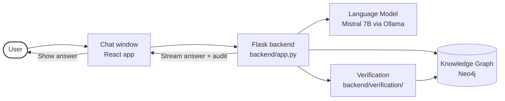
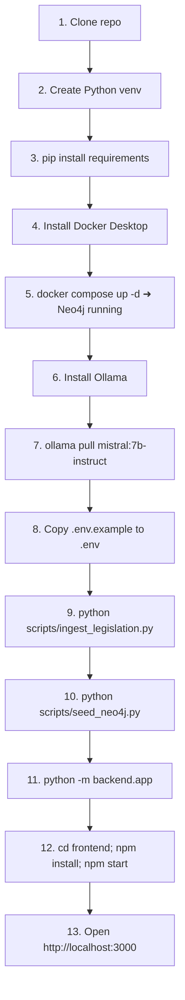
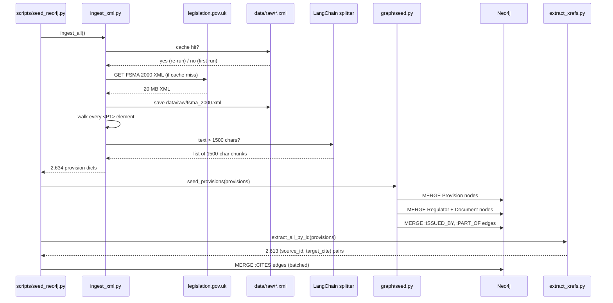
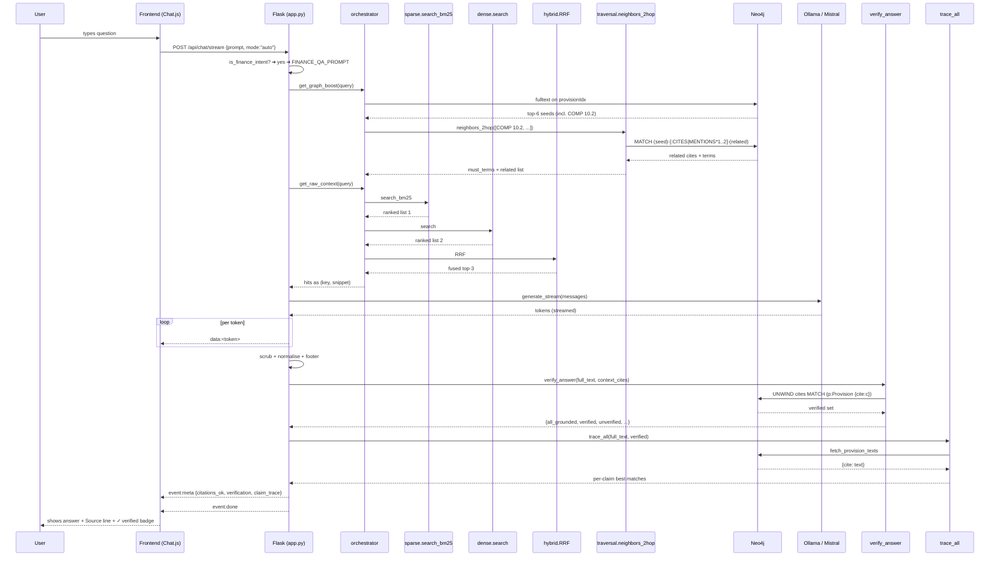
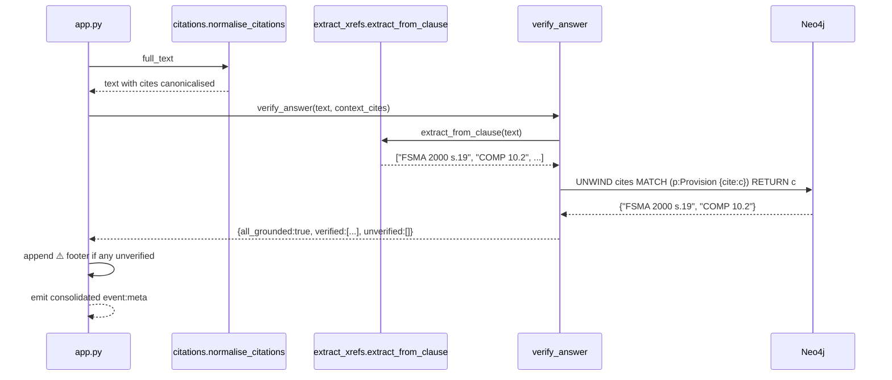
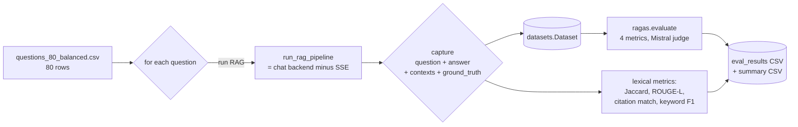
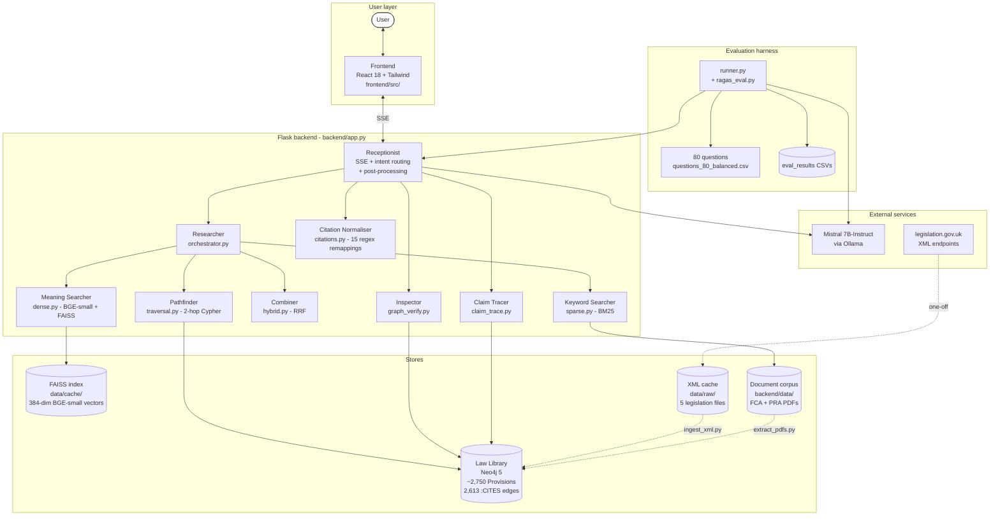

# How FinLaw-UK Works — A Plain-English Walkthrough

This document explains every step the FinLaw-UK system goes through,
from a developer's first `git clone` to a user receiving an answer on
screen. It is written for someone who has never seen the code before
and is not assumed to know what an "embedding" or a "vector" is. When
a technical term appears, the next set of parentheses tells you what
it means in everyday language.

---

## Section 1 — The big picture

**FinLaw-UK** is like having a very patient lawyer in your computer.
This lawyer has read every UK financial regulation — the Financial
Services and Markets Act, the FCA Handbook, the Money Laundering
Regulations, the Payment Services Regulations, and so on. You type
your question in a chat box; the lawyer answers in a few sentences,
with exact references to the rule that applies.

Two things make it different from a normal chatbot:

1. **It shows its work.** Every claim it makes points back to a
   specific paragraph of a specific law. You can click through to the
   actual text.
2. **A second part of the system double-checks the citations** before
   you ever see the answer. If the AI invents a rule that doesn't
   exist, that citation is flagged with a warning sign.

**Who it's for.** Compliance officers, in-house lawyers, RegTech
engineers, anyone who needs to answer UK finance-law questions and
who *cannot* send their documents to a cloud service like ChatGPT
(because the documents are confidential).

**What the user sees.** A normal chat window in a browser, like
ChatGPT. They type a question. They see the answer stream in, word
by word, with citations at the bottom. If anything is suspicious,
they see a yellow warning.



---

## Section 2 — The cast of characters

Think of the system as a team of specialists, each with one job.

**The Receptionist (`backend/app.py`).** Picks up every incoming
question, decides what kind of question it is (general chat / finance
Q&A / "traffic-light" compliance review), and hands it to the right
team. Also writes up the final answer with its quality checks
attached. *Analogy: the front desk at a law firm — they don't answer
the law question themselves, but they route you to the right
specialist.*

**The Researcher (`backend/retrieval/orchestrator.py`).** Given a
question, finds the most relevant paragraphs of law to feed to the
language model. Coordinates two different searchers and a graph
expert. *Analogy: a librarian who knows the building inside out.*

**The Keyword Searcher (`backend/retrieval/sparse.py`).** Looks for
literal word matches and uses **BM25** (a classic search-engine
algorithm that scores documents by how unusual the matching words are
— "FSCS" matters more than "the"). *Analogy: looking up a word in
the book's index.*

**The Meaning Searcher (`backend/retrieval/dense.py`).** Turns every
sentence into a long list of numbers called an **embedding**, then
finds nearby sentences in number-space. Catches paraphrases the
keyword searcher would miss. *Analogy: a person who reads two
sentences and tells you they mean the same thing even when no words
overlap.*

**The Combiner (`backend/retrieval/hybrid.py`).** Takes the keyword
searcher's ranked list and the meaning searcher's ranked list and
fuses them into one ranked list using **Reciprocal Rank Fusion**
(RRF — see the glossary). *Analogy: two judges score the same
contest and a third person averages the rankings.*

**The Law Library (`backend/graph/` + Neo4j).** A specialised
database that stores every law not as a flat document but as a graph
of connected nodes — a `Provision` node for each section, with
labelled string-style connections (`:CITES`, `:MENTIONS`,
`:PART_OF`) between related provisions. *Analogy: a filing cabinet
where every drawer has coloured string tied to other drawers, so you
can follow a topic from one law to the next.*

**The Pathfinder (`backend/graph/traversal.py`).** Given a starting
law, walks the graph one or two steps away to find related laws.
Returns the neighbourhood. *Analogy: starting at one book in the
library and following the references at the bottom of the page.*

**The Language Model (Mistral 7B via Ollama).** The actual AI that
writes the answer. It receives the retrieved laws as context and
generates a 4-6 sentence answer. *Analogy: a paralegal who can write
a coherent summary from the source material you hand them, but who
might occasionally get a detail wrong if you don't watch them.*

**The Inspector (`backend/verification/graph_verify.py`).** Reads
the AI's finished answer, finds every citation (like "FSMA 2000 s.19"),
and checks the Law Library to confirm each one is real. Flags any
that aren't. *Analogy: the senior partner who reviews the
paralegal's work and circles any reference that looks wrong.*

**The Claim Tracer (`backend/verification/claim_trace.py`).** Goes
sentence by sentence through the answer and identifies which cited
law best supports each claim. *Analogy: the same senior partner
drawing arrows from each sentence to the source that backs it up.*

**The Chat Window (`frontend/`).** A normal-looking React web app
in the browser. Sends questions to the backend, receives answers as
they stream in, displays them with the verification status.

---

## Section 3 — The setup story (developer's first day)

This is everything that has to happen *before* anyone can ask a
question. The whole sequence takes about 15–30 minutes on a fresh
machine.



### 1. Clone the repo

```powershell
git clone <repo-url> Masters_project
cd Masters_project
```

This copies all the code from the server to your computer. **What you
should see:** a new folder called `Masters_project` containing
`backend/`, `frontend/`, `docs/`, and so on. **If it fails:** check
your internet connection and that the URL is correct.

### 2. Create a Python virtual environment

```powershell
python -m venv .venv
.venv\Scripts\Activate.ps1            # Windows
# source .venv/bin/activate           # macOS / Linux
```

A **virtual environment** is a sealed-off copy of Python that keeps
the project's packages separate from everything else on your
computer. **What you should see:** your prompt now starts with
`(.venv)`. **If it fails:** make sure Python 3.11 or 3.12 is
installed (`python --version`).

### 3. Install Python packages

```powershell
pip install -r requirements.txt
```

`requirements.txt` lists every Python package the project depends on
— Flask, Neo4j driver, sentence-transformers, lxml, ragas, and so on.
This takes 5–15 minutes. **What you should see:** a long stream of
"Downloading…" / "Installing…" messages, then a final "Successfully
installed…". **If it fails:** the most common cause is no internet
connection or an old `pip`. Update `pip` with
`python -m pip install --upgrade pip` and try again.

### 4. Install Docker Desktop

Docker is a tool that lets you run pre-packaged services without
installing them onto your operating system directly. On Windows or
Mac, install Docker Desktop from https://docker.com. On Linux,
install `docker` and `docker compose` via your package manager.
**What you should see:** the Docker icon appears in your system tray
and `docker --version` works in the terminal.

### 5. Start Neo4j

```powershell
docker compose up -d
```

This reads `docker-compose.yml`, downloads the Neo4j 5 image (~600 MB
on first run), and starts a Neo4j server in the background. **What you
should see:** open http://localhost:7474 — you see the Neo4j Browser
login screen. Username `neo4j`, password `finlaw`. **If it fails:**
make sure ports 7474 and 7687 aren't already in use.

### 6. Install Ollama

Ollama is a tool that runs language models on your laptop. Download
from https://ollama.com. **What you should see:** `ollama --version`
prints a version number and the Ollama tray icon appears.

### 7. Pull the Mistral model

```powershell
ollama pull mistral:7b-instruct
```

This downloads the Mistral 7B-Instruct model (~4.1 GB) to your
machine. **What you should see:** a progress bar, then "success".
After this `ollama list` should include `mistral:7b-instruct`.

### 8. Configure environment variables

```powershell
Copy-Item .env.example .env
```

The `.env` file holds settings like the Neo4j password, the Ollama
URL, where to write evaluation results, and so on. The defaults work
for local development; edit if you changed any port or password.

### 9. Download the law from legislation.gov.uk

```powershell
python scripts/ingest_legislation.py --sample 5
```

This downloads the XML versions of FSMA 2000, RAO 2001, MLR 2017,
PSR 2017 and UK MAR from legislation.gov.uk into `data/raw/`. It
parses them and prints out a few sample provisions to confirm
everything works. **What you should see:** "XML: 2634 provisions"
followed by 5 sample provision summaries.

### 10. Populate the knowledge graph

```powershell
python scripts/seed_neo4j.py
```

This walks every parsed provision and creates a `Provision` node in
Neo4j for it. It also extracts cross-references between laws and
creates `:CITES` edges. Takes ~5 minutes. **What you should see:**
"Seed complete. Provisions=2750 Terms=… Regulators=5 Documents=5".

### 11. Start the backend

```powershell
python -m backend.app
```

Starts Flask listening on port 5000. **What you should see:**
`* Running on http://0.0.0.0:5000`. Open http://localhost:5000/ in a
browser — you see the health-check message.

### 12. Start the frontend

In a **second** terminal:

```powershell
cd frontend
npm install                            # first time only
npm start
```

This downloads ~1 GB of Node packages and starts the React
development server on port 3000. **What you should see:** "Compiled
successfully!" and your browser auto-opens http://localhost:3000.

### 13. Open the browser

Click "Chat" in the navigation. You see a chat window with a mode
selector (auto / general / finance / traffic-light). Type your first
question — for example, *"What is the UK general prohibition?"* — and
press Enter.

---

## Section 4 — The ingestion story (how law gets into the system)

When `python scripts/seed_neo4j.py` runs, this sequence plays out:



### Step by step

1. **The script connects to Neo4j** using credentials from the
   environment (`NEO4J_URI`, `NEO4J_USER`, `NEO4J_PASS`).
2. **It asks `ingest_xml.py` for the law text.** That module knows
   the URLs for the five legislation sources.
3. **`ingest_xml.py` checks `data/raw/` for cached XML.** If absent,
   it downloads from legislation.gov.uk and saves the result. On
   second runs everything is offline.
4. **The XML is walked element by element.** The parser finds every
   `<P1>` tag (the canonical "provision" element on
   legislation.gov.uk). For each, it reads the number from `<Pnumber>`
   (or from the `id` attribute when `<Pnumber>` is empty), the title
   from the parent `<P1group>`'s `<Title>`, and the body text by
   concatenating all the descendant text. Repealed sections (which
   appear as `". . . . . ."`) are skipped.
5. **Long sections get chunked** by `LangChain`'s
   `RecursiveCharacterTextSplitter` with `chunk_size=1500,
   chunk_overlap=150`. A section that's 5000 chars becomes 4 chunks
   that share the same citation but have unique IDs
   (`FSMA2000_s19_chunk0`, `_chunk1`, …).
6. **Each provision becomes a `Provision` node in Neo4j.** The
   `MERGE` Cypher statement creates the node if it doesn't exist or
   updates it if it does — so re-running the script is idempotent.
7. **Each provision is also turned into a vector** by the BGE-small
   embedding model and stored in the **FAISS** index at
   `data/cache/dense_embeddings.npy`. *(This happens lazily — the
   first chat after seeding triggers the build, not the seed script
   itself.)*
8. **`extract_xrefs.py` reads every provision's text** looking for
   phrases like "see section 19", "regulation 27", "COBS 4.2.1R", and
   so on. It uses 5 statutory regex patterns plus a context-aware
   pass (when processing a clause from FSMA 2000, bare "section 22"
   is interpreted as "FSMA 2000 s.22").
9. **Each cross-reference found becomes a `:CITES` edge** between
   two provisions. In the latest run, **2,613 edges** were created
   across 845 distinct target provisions.
10. **`Regulator` nodes get added** for FCA, PRA, HMT, ESMA, BoE,
    along with one `:ISSUED_BY` edge per provision.
11. **`Document` nodes get added** for FSMA 2000, RAO 2001, MLR 2017,
    PSR 2017, UK MAR, along with one `:PART_OF` edge per provision.

### Worked example — one provision's journey

**Before (raw XML from legislation.gov.uk):**

```xml
<P1group>
  <Title>General prohibition</Title>
  <P1 id="section-19">
    <Pnumber/>
    <P1para>
      <Text>No person may carry on a regulated activity in the
      United Kingdom, or purport to do so, unless he is an authorised
      person or an exempt person.</Text>
    </P1para>
  </P1>
</P1group>
```

**During ingestion (Python dict produced by `parse_legislation_xml`):**

```python
{
  "id": "FSMA2000_s19",
  "cite": "FSMA 2000 s.19",
  "title": "General prohibition",
  "text": "No person may carry on a regulated activity in the UK ...",
  "module": "HMT",
  "domain": "FSMA",
  "document": "FSMA 2000",
  "regulator": "HMT",
  "hierarchy_path": "/FSMA 2000/s.19",
}
```

**After ingestion (Neo4j node + relationships):**

```
(:Provision {
  id: "FSMA2000_s19",
  cite: "FSMA 2000 s.19",
  title: "General prohibition",
  text: "No person may carry on a regulated activity...",
  module: "HMT", domain: "FSMA"
})
   ─[:ISSUED_BY]──▶ (:Regulator {name: "HMT"})
   ─[:PART_OF]────▶ (:Document {name: "FSMA 2000"})
   ─[:CITES]──────▶ (:Provision {cite: "FSMA 2000 s.21"})  -- restriction on financial promotion
   ─[:CITES]──────▶ (:Provision {cite: "FSMA 2000 s.22"})  -- regulated activities
```

---

## Section 5 — The query story (what happens when a user asks a question)

A user types *"What is the FSCS deposit protection limit?"* and
presses Enter. Here is everything that happens in the next 8–15
seconds.



### Step by step (numbered)

1. **The user types the question** in the React chat input.
2. **The frontend sends a POST** to `http://localhost:5000/api/chat/stream`
   with `{prompt: "What is the FSCS deposit protection limit?", mode: "auto"}`.
3. **The backend's `app.py` receives the request.** It calls
   `is_finance_intent("What is the FSCS deposit protection limit?")`
   — the question matches keywords like *FSCS*, so the answer is
   `True`. It picks the `FINANCE_QA_PROMPT` system message.
4. **The Receptionist calls the Researcher's `get_graph_boost(query)`.**
   This runs a Neo4j fulltext query on the `provisionIdx` index.
   For our question, the top hit is `COMP 10.2 — FSCS deposit
   protection` because the title contains both "FSCS" and "deposit".
5. **The Pathfinder expands the seeds 2 hops** via `:CITES|MENTIONS|DEFINED_BY`.
   `COMP 10.2` connects via `:MENTIONS` to terms like "FSCS",
   "deposit protection", "compensation scheme". Related provisions
   like `FSMA 2000 s.213` (the FSCS-establishing section) come back.
6. **The Researcher's `get_raw_context(query)` runs hybrid retrieval
   over the document corpus.** The Keyword Searcher returns matches
   from BM25; the Meaning Searcher returns nearest neighbours from
   the FAISS index; the Combiner fuses them with **Reciprocal Rank
   Fusion** (RRF — see glossary).
7. **Hybrid returns the top-3 snippets** as `(key, snippet)` pairs.
   One of them is the actual COMP 10.2 text describing the £85,000
   limit.
8. **The Receptionist assembles the prompt.** It puts graph bullets
   first (highest authority), document snippets next, the user's
   question last, all under the `FINANCE_QA_PROMPT` system message.
9. **The prompt goes to `ollama_client.generate_stream(messages)`.**
   That HTTP-streams from Ollama's `/api/chat` endpoint.
10. **Mistral streams tokens back, one chunk at a time.** Each chunk
    is relayed straight to the frontend as an SSE
    (Server-Sent Events) `data:<token>` frame. The user sees the
    answer appearing word by word.
11. **As tokens arrive, the Receptionist tracks `<think>...</think>`
    blocks** — Mistral sometimes wraps its reasoning in those tags.
    Those tokens are suppressed from the user-visible stream; their
    elapsed time is reported in an `event:meta thought_ms` frame.
12. **When generation finishes,** the buffered full text gets
    post-processed: `scrub_known_bad` removes URL artifacts,
    `normalise_citations` fixes near-misses (e.g. "COBS 4.2" →
    "COBS 4.2.1R" via 15 regex remappings), and `fix_currency`
    fixes the "£" mojibake.
13. **A `Source:` line is appended** if Mistral didn't add one — the
    Receptionist uses the source line built earlier by
    `get_graph_boost`.
14. **The Inspector runs `verify_answer(full_text, context_cites)`.**
    It extracts every cite from the answer ("COMP 10.2", "FSMA
    2000 s.213"), then runs a single Cypher query that asks Neo4j
    *which of these cites exist as Provision nodes?* The ones that
    match go into `verified`; the rest go into `unverified`.
15. **For our example: both citations exist** → `all_grounded: true`.
    No warning footer is added.
16. **The Claim Tracer runs `trace_all(full_text, verified)`.** It
    fetches the text of each verified provision in one Cypher
    round-trip, splits the answer into sentence-level claims, and
    scores each claim against each cited provision by non-stopword
    token overlap. The output is a list of `{claim, best_match}`
    records.
17. **All the audit data is bundled** into a single SSE meta event:
    `{citations_ok: true, invalid: [], verification: {…},
    claim_trace: [...]}` and sent.
18. **The frontend renders the streamed tokens** as Markdown in the
    chat bubble. The mode badge and the per-message audit are
    visible to the user.
19. **The chat is saved to localStorage** (no backend database is
    involved in chat persistence in the current build).

### What the user sees

A bubble containing something like:

> Eligible deposits at an authorised UK firm are protected by the
> Financial Services Compensation Scheme up to **£85,000 per person
> per firm**. Joint accounts are treated separately, doubling the
> effective cap. Eligibility is governed by FCA Handbook rules and the
> firm must be FCA-authorised under FSMA 2000. Claims are handled by
> the FSCS directly and typically paid within a few weeks.
>
> **Source:** COMP 10.2 | FSMA 2000 s.213

A small green check (✓ verified) appears next to the answer because
both citations were grounded in the graph.

---

## Section 6 — The verification story (how the system checks itself)

This is the part the recommendation letter calls "symbolic
verification." Plain English: it's the difference between *"the AI
said it, so it's true"* (bad) and *"the AI said it, and we just
checked the actual law database to make sure that law really
exists"* (good).

### How it runs



1. **The model's answer has finished streaming** to the frontend.
   The full text sits in a buffer on the server.
2. **A regex pass extracts every citation-like string.** Patterns
   in `extract_xrefs.py` catch *FSMA 2000 s.19*, *COBS 4.2.1R*,
   *MLR 2017 reg.27*, etc. — both fully-qualified and short-forms.
3. **Each cite is normalised** by `verification/citations.py`. This
   collapses near-misses ("COBS 4.2" without the trailing rule
   number becomes "COBS 4.2.1R"; lowercase "cobs 4.2.1r" becomes
   uppercase). 15 regex remappings cover the most common patterns.
4. **A single Cypher query asks Neo4j**: *"For this list of
   normalised cites, which ones exist as `Provision` nodes?"* This
   is one round-trip; it returns the verified subset.
5. **Each cite is bucketed.** Hits → `verified`. Misses →
   `unverified`. If the user passed a list of "context cites" (the
   citations the retriever surfaced to the model), any answer
   citation that wasn't in the context → `hallucinated_context`
   (i.e., the model is citing something it was never shown).
6. **A summary is returned** to the user as an SSE meta event:
   ```json
   {
     "all_grounded": true,
     "all_retrieved": false,
     "verified": ["FSMA 2000 s.19", "COMP 10.2"],
     "unverified": [],
     "hallucinated_context": ["COMP 10.2"],
     "note": ""
   }
   ```
7. **If anything is unverified,** a yellow warning footer is added
   to the visible answer:

   > ⚠️ The following citations could not be matched against the
   > graph: `FSMA 2000 s.9999`.

### Why this matters

Language models routinely *make up* citations that sound right but
don't exist. In a compliance context that's dangerous — a wrong
citation can mislead a compliance officer into thinking they've
checked their work when they haven't. By looking up every cite in a
real knowledge graph, the system can tell the difference between a
real legal reference and a plausible-sounding fabrication, and
surface the difference to the user.

The verification step is decoupled from the language model — if
Mistral is replaced with GPT-4 tomorrow, the verification still
works.

---

## Section 7 — The evaluation story (how we know it works)

`python scripts/run_evaluation.py` measures the system against a
fixed test set so we can tell whether changes are improving things.

### What it does



1. **Loads 80 questions** from
   `backend/evaluation/questions/questions_80_balanced.csv`. Each row
   has the question, the gold answer, the expected citations, and
   the expected keywords.
2. **For each question, runs the full RAG pipeline.** Same
   orchestrator, same graph boost, same Mistral generation as a real
   chat — just no SSE streaming, just collect the final answer.
3. **Captures the retrieval contexts.** The function
   `gather_contexts(question)` returns the flat list of every
   snippet shown to the model.
4. **Builds a `datasets.Dataset`** with columns
   `[question, answer, contexts, ground_truth]`.
5. **Calls `ragas.evaluate(dataset, metrics=[faithfulness,
   answer_relevancy, context_precision, context_recall], llm=judge,
   embeddings=embed)`.** The judge LLM is Mistral 7B via Ollama by
   default; the embeddings are BGE-small (re-using the Stage 1
   encoder).
6. **Writes results** to
   `data/eval_results/eval_results_<mode>_<timestamp>.csv` per
   question, plus a `_summary.csv` with the metric averages.

### The four metrics in one line each

- **Faithfulness** — *does every claim in the answer follow from
  the retrieved context?* Catches hallucination.
- **Answer relevancy** — *does the answer actually address the
  question, or does it ramble off-topic?*
- **Context precision** — *of the snippets we retrieved, what
  fraction were actually relevant?* Diagnoses noisy retrieval.
- **Context recall** — *of the facts in the gold answer, what
  fraction were covered by the retrieved context?* Diagnoses
  missing retrieval.

### Why a local judge

The dissertation principle is "no cloud APIs at any stage." If the
generator runs locally but the judge runs in the cloud, the system
is no longer fully local. By using Mistral 7B for both generation
and judging, the entire evaluation pipeline can run on the user's
laptop. The trade-off is a less calibrated judge (Mistral is no
GPT-4) — so the scores are useful as *relative* signals (system A
vs system B) but not as absolute quality numbers. The `--judge hf`
flag swaps Mistral-via-Ollama for Mistral-via-HuggingFace; the
`_build_judge_llm` function in `ragas_eval.py` would accept a
`ChatOpenAI` plug-in for a GPT-4 comparison run.

---

## Section 8 — The complete picture

This is the diagram for a single slide.



### What v2 would add

- **NLI (Natural Language Inference) claim verification.** Replace
  the keyword-overlap claim tracer with a real entailment model
  (e.g. DeBERTa-v3-mnli, ~440 MB). Today the tracer says *"these
  words overlap"*; v2 would say *"this provision actually entails
  this claim"*.
- **Citation hover-cards on the frontend.** Hover over `FSMA 2000
  s.19` in an answer and see the full provision text inline.
- **Active-learning for new citation patterns.** When the normaliser
  misses a citation pattern the user has to manually correct,
  propose adding a new regex remapping.
- **Continuous evaluation in CI.** Run the sample-5 RAGAS suite on
  every code change and alert if faithfulness drops by more than
  5%.
- **Multi-jurisdiction.** Add EU MAR, US Dodd-Frank, Singapore MAS
  rules — same ingestion pipeline, same verification pattern.

---

## Section 9 — Glossary

**API** — *Application Programming Interface*. A way for two
programs to talk to each other. The frontend talks to the backend
through an API.

**BM25** — A classic search-engine algorithm that scores documents
by how often the query words appear, weighted by how rare each word
is across the whole corpus. Unusual words ("FSCS") count for more
than common words ("the").

**Cosine similarity** — A way of measuring how similar two
embeddings are by looking at the angle between them in
number-space. Two vectors pointing the same direction = similarity
1.0; perpendicular = 0; opposite = -1.

**Cypher** — Neo4j's query language. Like SQL but for graph
databases. Looks like `MATCH (n:Provision)-[:CITES]->(m) RETURN n, m`.

**Dense retrieval** — Searching by meaning. Each document and the
user's query both get turned into vectors; the system finds the
nearest vectors. Works for paraphrases that keyword search misses.

**Embedding** — A long list of numbers (a vector) that captures the
meaning of a piece of text. Texts with similar meanings end up close
to each other in the number-space. BGE-small produces 384-number
embeddings.

**FAISS** — A library by Facebook for searching through millions of
embeddings quickly. We use `IndexFlatIP`, the exact (not
approximate) version, because our corpus is small.

**Fulltext index** — A Neo4j feature for searching text within
nodes. The `provisionIdx` index covers title, text, cite, terms,
module, domain — so any of those words can match a query.

**Hallucination** — When a language model invents a fact that
sounds plausible but isn't true. The whole point of the verification
layer is to catch hallucinated citations.

**Knowledge graph** — A database that stores information as a graph
of connected entities. Nodes are things (laws, regulators); edges
are typed relationships (`:CITES`, `:ISSUED_BY`).

**LangChain** — A Python framework for building LLM applications.
This project uses one small piece of it — the
`RecursiveCharacterTextSplitter` — for clause-level chunking only.

**LLM (Large Language Model)** — An AI that generates text. Mistral
7B-Instruct is the LLM in this project.

**Neo4j** — A graph database. Stores the knowledge graph. Runs in
Docker on `localhost:7687`.

**NLI (Natural Language Inference)** — A type of model that
decides whether one sentence entails (logically implies), contradicts,
or is neutral with respect to another. Not used in the current build
but listed as v2 work.

**Ollama** — A tool that runs language models locally. Listens on
port 11434. The chat backend talks to it via HTTP.

**Provision** — Our generic name for a section / regulation /
article — one self-contained unit of law. The `Provision` node
label in Neo4j.

**RAG (Retrieval-Augmented Generation)** — The pattern of
augmenting an LLM by feeding it retrieved documents as context, so
it answers based on real source material instead of relying purely
on its training data.

**RAGAS** — A Python library that scores RAG systems on four
metrics: faithfulness, answer relevancy, context precision, context
recall. Uses an LLM as the judge.

**Reciprocal Rank Fusion (RRF)** — A way of combining two ranked
lists into one. Each item's score is the sum of `1 / (k + rank)`
across appearances. The constant `k=60` (the literature default)
makes the top of each list dominate without one source completely
winning.

**Sentence transformer** — A model that turns sentences into
embeddings. BGE-small-en-v1.5 is the one this project uses.

**Sparse retrieval** — Searching by keyword. The opposite of dense.
BM25 is the sparse method we use.

**SSE (Server-Sent Events)** — A web standard for streaming text
from a server to a browser. The backend uses SSE to send tokens to
the frontend one at a time, so the user sees the answer appearing
word by word.

**Symbolic verification** — Checking generated content against a
structured database of known-true facts. *Symbolic* because the
check is exact (does this provision exist, yes/no), not statistical.

**Vector / vector space** — A mathematical object that's just a
list of numbers. Embeddings are vectors. The collection of all
embeddings forms a vector space; nearby vectors mean similar things.
